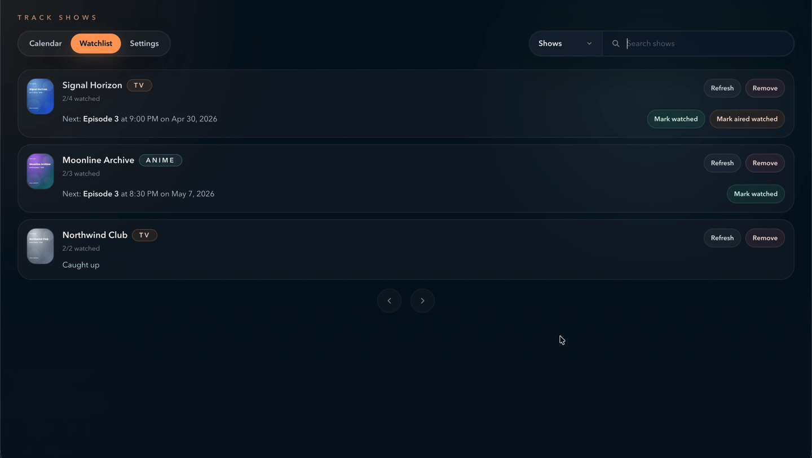
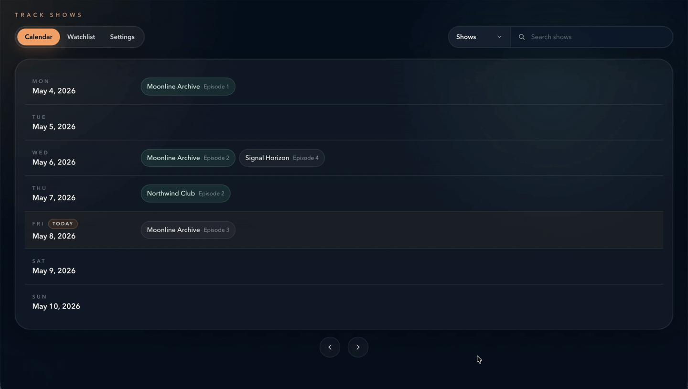
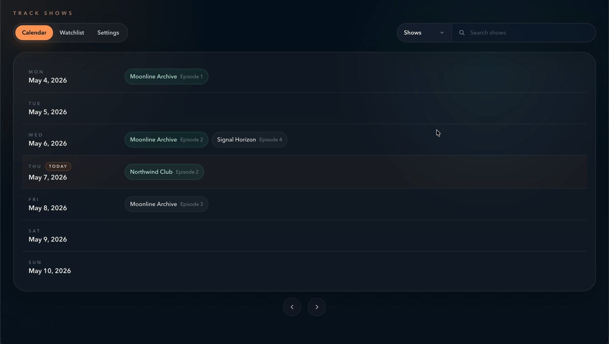

# Track Shows

Track Shows is a local-first React app for tracking TV shows. It combines a weekly calendar, a paginated watchlist, and optional private cloud sync so you can keep your data on your machine by default.

## What It Does

- Search TV shows through TVMaze.

  
- Switch between Calendar, Watchlist, and Settings tabs.

  
- Search either the show catalog or your tracked watchlist.

  
- Track episodes, mark them watched, or mark all aired episodes watched.

  

## Demo Mode

If you want to launch the app with seeded sample data, run:

```bash
npm run dev:demo
```

This seeds a separate `.track-shows-demo/` persistence directory, leaves your real `~/.track-shows/` data untouched, and starts the app on `http://127.0.0.1:5174`.

Use `npm run dev` to go back to your normal local data. To refresh the mock snapshot, run `npm run demo:seed`.

## Getting Started

```bash
npm install
npm run dev
```

`npm run dev` starts the app on `http://localhost:5173` and uses `~/.track-shows/` by default unless `TRACK_SHOWS_DATA_DIR` is set.

Useful scripts:

- `npm run build` for a production build
- `npm run preview` to preview the production build locally
- `npm run test` to run the test suite once
- `npm run test:watch` to keep Vitest running in watch mode
- `npm run storybook` to browse the page states in Storybook
- `npm run build-storybook` to generate a static Storybook build
- `npm run demo:seed` to refresh the demo snapshot in `.track-shows-demo/`
- `npm run dev:demo` to seed the demo snapshot and start the demo server

## Stack

- React
- TypeScript
- Tailwind CSS
- Vite
- Vitest
- Storybook

## Data And Environment

- Local app data is stored in `~/.track-shows` by default.
- Set `TRACK_SHOWS_DATA_DIR` to use a different local directory.
- Set `TRACK_SHOWS_DEMO_DATA_DIR` to write the demo snapshot somewhere else.
- The local data directory stores the tracked-show snapshot and `cloud-sync.json` connection state.
- The search scope preference is stored in browser local storage.
- Copy `.env.example` to `.env.local` if you prefer file-based environment values.
- Cloud sync credentials are optional and are only needed if you want to connect Google Drive or Dropbox.
- `TRACK_SHOWS_GOOGLE_DRIVE_CLIENT_ID`
- `TRACK_SHOWS_GOOGLE_DRIVE_CLIENT_SECRET`
- `TRACK_SHOWS_DROPBOX_CLIENT_ID`
- `TRACK_SHOWS_DROPBOX_CLIENT_SECRET`
- `TRACK_SHOWS_PUBLIC_ORIGIN` is optional and should be the exact public origin for one trusted deployment.

## Cloud Sync

Cloud sync is available from the Settings page once the matching OAuth credentials are set.
The app always keeps a local copy in `~/.track-shows`. If you serve it from a different public origin, set `TRACK_SHOWS_PUBLIC_ORIGIN` so browser requests and OAuth callbacks line up.

`TRACK_SHOWS_PUBLIC_ORIGIN` only relaxes same-origin checks for one trusted origin; it is not authentication, so do not expose the app to untrusted users without another access-control layer.

## Container

A GitHub Actions workflow builds and publishes a container on every push to `main` when the
`DOCKERHUB_USERNAME` and `DOCKERHUB_TOKEN` secrets are configured.

```yaml
services:
  track-shows:
    image: your-dockerhub-user/track-shows:latest
    ports:
      - "4173:4173"
    environment:
      TRACK_SHOWS_PUBLIC_ORIGIN: https://track-shows.example.com
    volumes:
      - track-shows-data:/data/track-shows

volumes:
  track-shows-data:
```

The container writes runtime JSON to `/data/track-shows`, so mounting that path keeps your data between restarts.

## Data Sources

- TV show search, schedules, and episode metadata are provided by [TVmaze](https://www.tvmaze.com/) under CC BY-SA.
